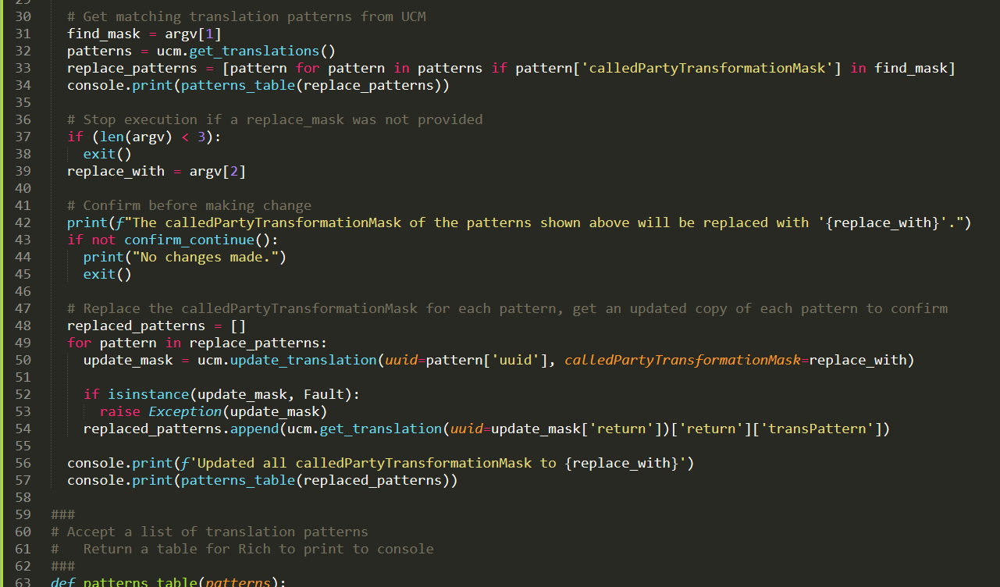
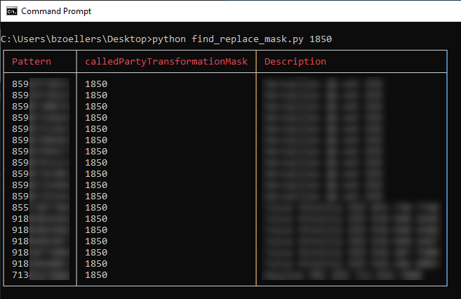

# Automating Cisco CallManager



Last week, I was presented with the need to modify a number of translation patterns in Cisco CallManager (CUCM) to support the implementation with a new auto attendant for one of my customers.

If you've worked with CUCM before, you likely know that translation patterns work similarly to NAT for phone calls. For example: you might set a translation pattern's calledPartyTransformationMask to map a call to an external number from a remote party to an internal extension in your organization.

API's are much more interesting to me than the intricacies of CUCM, so I'll save you the headache of hearing about that. Suffice it to say: there isn't an easy way to find all translation patterns with a specific calledPartyTransformationMask and modify that mask to reflect a new internal extension.

<!-- more -->

I'll start with the end product. My Python solution was a simple "find and replace" tool for calledPartyTransformationMasks within the translation patterns on CUCM. It's simple to use, and allows for both the "find" and "find and replace" operation.

```
find_replace_mask.py <mask_to_find> <optional: mask_to_replace_with>
```

<figure markdown>
  { loading=lazy }
  <figcaption>"Find" operation - find all translation patterns with a specified calledPartyTransformationMask</figcaption>
</figure>

## Ciscoaxl Python Library

Starting off, I just want to point out how easy to use the [ciscoaxl Python library](https://github.com/PresidioCode/ciscoaxl) is. Shoutout to Presido for making this available to the community. The CUCM AXL API can be daunting, but this library makes working with it a breeze.

``` py title="Connect to CallManager and get a list of all translation patterns"
ucm = axl(
    username="cmadmin",
    password="yourCUCMPassword",
    cucm="yourCUCM.yourcompany.com",
    cucm_version="11.5"
)

patterns = ucm.get_translations()
```

## List Comprehensions

Another Python option I really enjoy is the ability to perform [list comprehensions](https://www.w3schools.com/python/python_lists_comprehension.asp). In this case, I used a list comprehension to sort through the list of patterns, and create a smaller list that only includes patterns matching the <mask_to_find>.

``` py title="List comprehension to filter the list of translation patterns"
find_mask = argv[1]
replace_patterns = [pattern for pattern in patterns if pattern['calledPartyTransformationMask'] in find_mask]
```

Don't feel daunted by that long single line of code! Here is what it's actually doing.

``` py title="The 'long version' of a list comprehension"
# Create a new list
replace_patterns = []
# Iterate through each pattern
for pattern in patterns:
    # If the calledPartyTransformationmask matches, add this pattern
    # to the new list
    if pattern['calledPartyTransformationMask'] in find_mask:
        replace_patterns.append(pattern)
```

List comprehensions were confusing for me when starting off with Python, but I love the complexity that you can hide within a single line of code.

## Rich Library

I finish my tool off with the [rich library](https://github.com/willmcgugan/rich) for Python. This is a phenomenal option for creating formatted, rich text at the command line. It's capable of much more than the simple table output in my script.

I created a helper function to take in a list of translation pattern objects, and return a table object that can be printed to the console by rich.

``` py title="Creating a table to display with rich"
def patterns_table(patterns):
  table = Table(show_header=True, header_style="bold red")
  table.add_column("Pattern")
  table.add_column("calledPartyTransformationMask")
  table.add_column("Description")

  for pattern in patterns:
    table.add_row(
      pattern['pattern'],
      pattern['calledPartyTransformationMask'],
      pattern['description']
    )

  return table
```

Displaying this table is super simple, and makes the output much more readable.

``` py title="Print a table object with rich"
console = Console()
table = patterns_table(replace_patterns)
console.print(table)
```

There is a bit more to my find and replace tool that I haven't covered here, so if you'd like to check it out in it's entirety it is available to review and use on GitHub! All in all, this tool allowed our team to replace the *calledPartyTransformationMask* on about 20 translation patterns in a single run of the script.

https://github.com/bzoel/py-net-scripts/tree/master/cucm/find_replace_mask