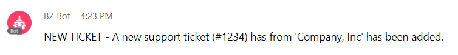
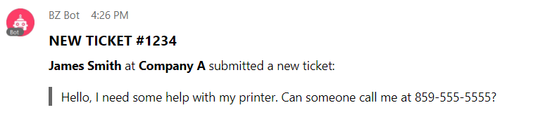
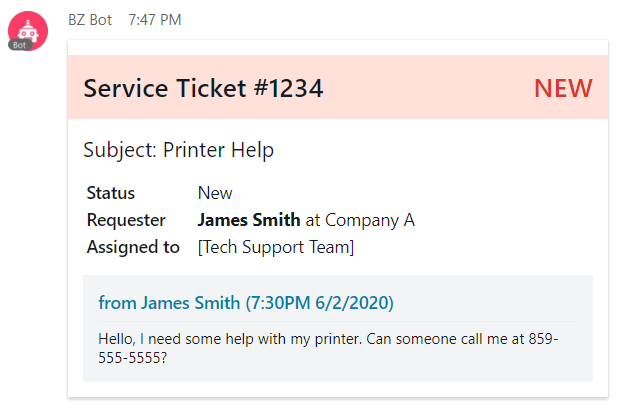

# What are Cards on Webex Teams?

Over the past year we've seen exciting new additions to the Webex Teams API that introduce some exciting new options for bots and integrations to interact with end users. One of these additions is support for 'in chat' [buttons & cards](https://developer.webex.com/blog/new-buttons-cards-webex-teams).

Buttons & cards add a new way to format messages in Webex Teams - before diving in, let's take a look at the previous message formatting options:

<!-- more -->

## Plain Text
This is is pretty obvious. Plain text probably the most common message format you'll find. As a user I send many plain text messages every day, and they achieve my goal! Using the API, bots can exchange plan text messages with users. Let's consider a support ticketing application; when a ticket is received, a bot could message the tech support room with a heads up:

<figure markdown>
  { loading=lazy }
  <figcaption>A 'plain text' message in Webex Teams</figcaption>
</figure>

Problem solved. Our bot can let us know a new ticket has been received with a few pertinent details like the ticket number and company name. The message is straightforward, but doesn't include too much information. We could include more, but that might look like a wall of text to the user. Our user can login to the support ticketing application and gather more information.

## Markdown
The support ticketing bot was a huge success! And now our users want more information details provided in Webex Teams so they can decide how important a ticket is directly from the tech support team chat. Introducing [markdown](https://daringfireball.net/projects/markdown/syntax). Markdown is a common formatting syntax on the web, touted as being easy to read and write.

Webex Teams does not support the full set of markdown formatting options, but the limited set it does support will allow us to improve the bot's message formatting. The Webex [API basics](https://developer.webex.com/docs/api/basics#formatting-messages) guide provides some details on the specific options that are supported. Here's an example of a markdown formatted message:

<figure markdown>
  { loading=lazy }
  <figcaption>A 'markdown' formatted message in Webex Teams</figcaption>
</figure>

This helps quite a bit! We can use rich text formatting to differentiate between the data in this message.

## Cards
Using markdown allowed us to provide more data in a more readable fashion - which is a major improvement. Our users want more! What if they could see all the information included on a support ticket, without ever leaving Webex Teams?

Buttons & Cards were introduced for Webex Teams in August 2019, and they are based on the [Adaptive Cards](https://adaptivecards.io/) framework from Microsoft.

The Adaptive Cards framework allows us to insert small UI snippets - called cards - into the Webex Teams interface. Let's improve our support ticket bot by using an adaptive card in the tech support room:

<figure markdown>
  { loading=lazy }
  <figcaption>An Adaptive Card in Webex Teams</figcaption>
</figure>

Success! We can now display all the specific about the ticket, but everything looks well formatted and easy to read for the end users.