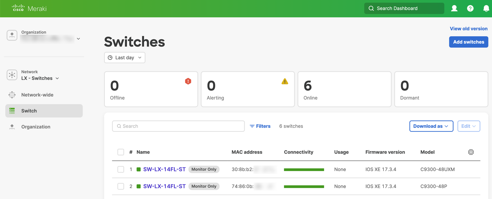
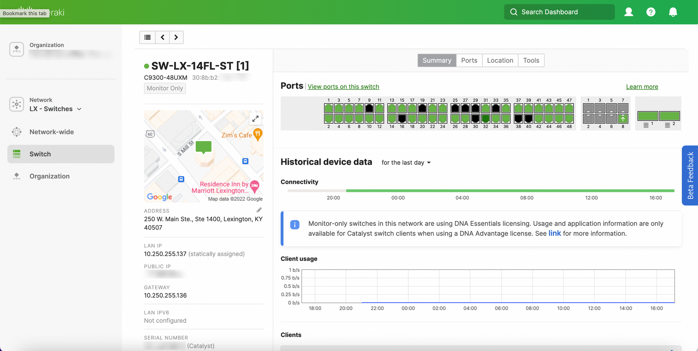
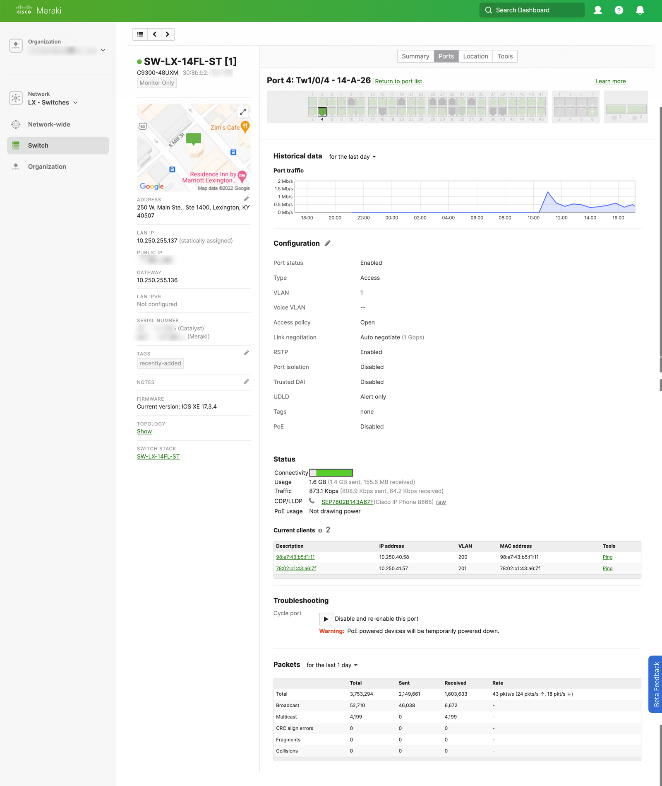

# Catalyst on Meraki: Getting Started

<figure markdown>
  { loading=lazy }
  <figcaption>Two Catalyst 9300 switches monitored in Meraki Dashboard</figcaption>
</figure>

Cisco Live 2022 represents the birth of "Catalyst on Meraki", a new feature that brings traditional Cisco Catalyst hardware into the Meraki Dashboard. You have the option to use two 'modes' of operation:

<!-- more -->

## Catalyst on Meraki modes

### Monitor mode (or DNA mode)
Available now! Switches will continue to run IOS-XE and be configured via the CLI (or your configuration tool of choice). Initial support includes C9200, C9300, and C9500. No downtime to enable this.

### Meraki mode
Coming soon. This mode will essentially turn your Catalyst switch into an MS390. Initial support will include the first release C9300 models, and IOS-XE 17.8.1+ will be required. This will require a reboot of the switch into Meraki mode, and you'll need to reconfigure from the Meraki cloud.

Since *monitor mode* is available now, I'm sure you're asking how to get started. Let's give it a try!

## Getting Started
The onboarding process involves a Windows/Mac/Linux application called *Cloud Monitoring for Catalyst* that connects to your Meraki dashboard using the Dashboard API (REST) and creates an initial monitoring configuration on your Catalyst switch using SSH. Check out that process here:

<iframe width="560" height="315" src="https://www.youtube.com/embed/67jA7SKW9B8" title="YouTube video player" frameborder="0" allow="accelerometer; autoplay; clipboard-write; encrypted-media; gyroscope; picture-in-picture; web-share" allowfullscreen></iframe>

Whoops. You didn't think I was going to make it that easy did you? The configuration of our Catalyst switches caused a little issue. Taking a look behind the Meraki-simple curtain, here's what happened:

``` title="Onboarding commands"
switch#show history all
...
CMD: 'terminal width 0' 20:29:32 EDT Tue Jun 14 2022
CMD: 'terminal length 0' 20:29:35 EDT Tue Jun 14 2022
CMD: 'enable' 20:29:37 EDT Tue Jun 14 2022
CMD: 'show platform sudi certificate' 20:29:40 EDT Tue Jun 14 2022
CMD: 'show version' 20:29:46 EDT Tue Jun 14 2022
CMD: 'show clock detail' 20:29:48 EDT Tue Jun 14 2022
CMD: 'telnet us.tlsgw.meraki.com 443' 20:29:51 EDT Tue Jun 14 2022
CMD: 'exit' 20:29:51 EDT Tue Jun 14 2022
```

Using `show history all` I was able to review the CLI commands executed by the Cloud Monitoring for Catalyst application. In our case `telnet us.tlsgw.meraki.com 443` was failing because of the VTY configuration on this switch.

``` title="Nonworking VTY line configuration"
switch#show run | sec line vty 0
line vty 0 4
 exec-timeout 60 0
 privilege level 15
 transport input ssh
 transport output ssh
```

Let's change this to `transport output all` and try again!

<iframe width="560" height="315" src="https://www.youtube.com/embed/-GioWDQXXac" title="YouTube video player" frameborder="0" allow="accelerometer; autoplay; clipboard-write; encrypted-media; gyroscope; picture-in-picture; web-share" allowfullscreen></iframe>

You may have noticed in the video, that *Cloud Monitoring for Catalyst* applied some CLI configuration to the Catalyst switch. This new configuration does a few things:

- Enable netconf-yang, IP routing, and LLDP
- Create AAA configuration with a user and certificate for SSH from Meraki
- Create a TLS tunnel to the Meraki Dashboard

You can review this configuration by using the *show details* button within the onboarding wizard. I have included the detailed configuration below:

``` title="Meraki IOS-XE configuration"
! Ensure old tunnel config is removed.
no crypto tls-tunnel MERAKI-PRIMARY

! Ensure old CA certificates are removed.
no crypto pki trustpoint MERAKI_TLSGW_CA
  yes

! Ensure old access-lists are removed.
no ip access-list extended MERAKI_VTY_IN
no ip access-list extended MERAKI_VTY_OUT

! Enable netconf (requires ip routing).
netconf-yang
ip routing

! Enable LLDP for topology.
lldp run

! Configure SSH v2 with publickey authentication for cloud authentication.
ip ssh version 2
ip ssh server algorithm authentication publickey password keyboard

! Prevent traffic that should be in the tunnel from falling back to default route when the tunnel is down.
ip route 18.232.244.158 255.255.255.255 Null 0

! Create local authentication group for SSH through the TLS tunnel.
aaa authentication login MERAKI local
aaa authorization exec MERAKI local

! Create ACL for cloud SSH ingress.
! Allow only port 2222 for SSH.
ip access-list extended MERAKI_VTY_IN
  10 permit tcp host 18.232.244.158 any eq 2222
  20 deny   tcp any any

! Create ACL for cloud telemetry egress.
! Allow only port 2022 for SFTP to the cloud.
ip access-list extended MERAKI_VTY_OUT
  10 permit tcp any host 18.232.244.158 eq 2022
  20 deny   tcp any any

! Configure a SSH rotary to use port 2222.
ip ssh port 2222 rotary 50

! Enable SSH to VTY lines to be dedicated for cloud.
! Use ACL and AAA groups to secure connections.
line vty 32 33
  access-class MERAKI_VTY_IN in
  access-class MERAKI_VTY_OUT out
  authorization exec MERAKI
  login authentication MERAKI
  rotary 50
  transport input ssh
  exit

! Configure a local Meraki user with SSH Keys for SSH and NETCONF access.
username meraki-user privilege 15 secret 9 <secret>
ip ssh pubkey-chain
  username meraki-user
    key-string
      <key string>
      
exit
exit
exit

! Import the correct certificate authority for SSL verification.
crypto pki trustpoint MERAKI_TLSGW_CA
enrollment terminal
crypto pki authenticate MERAKI_TLSGW_CA
-----BEGIN CERTIFICATE-----
<certificate>
-----END CERTIFICATE-----
quit
yes

! Configure trustpoint for SSL verification.
crypto pki trustpoint MERAKI_TLSGW_CA
  enrollment url flash://MERAKI_TLSGW_CA
  revocation-check none

! Create Loopback interface for TLS tunnel overlay.
interface Loopback1000
  description Meraki TLS Connection
exit

! Configure TLS tunnel for Cloud Connectivity.
! Selecting the preferred source based on the current default route.
crypto tls-tunnel MERAKI-PRIMARY
  server url us.tlsgw.meraki.com port 443
  overlay interface Loopback1000
  local-interface TenGigabitEthernet2/1/8 priority 1
  pki trustpoint CISCO_IDEVID_SUDI sign
  pki trustpoint MERAKI_TLSGW_CA verify
  no shut
  exit
```

Once this is done, after a few minutes you'll see your Catalyst switch in the Meraki Dashboard.

{ width=600 }

{ width=600 }