# Let's upgrade Cisco SD-WAN
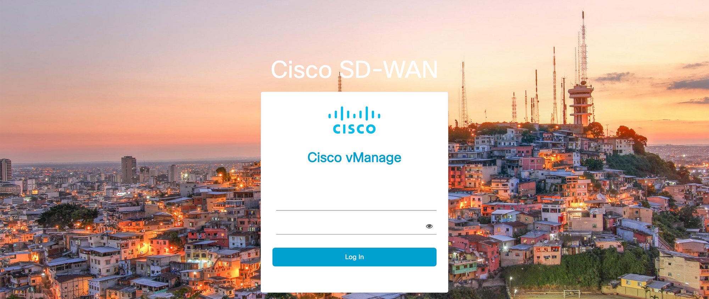

I've long raved about how easy it is to perform an upgrade to the components of Cisco SD-WAN. Join me as we upgrade to the new gold star - 20.6.3 for the Viptela components with 17.6.3a for the cEdge.

The environment is currently running the previous gold star release of Cisco SD-WAN:

- vManage/vSmart/vBond 20.3.5
- vEdge 20.3.5
- IOS-XE (cEdge) 17.3.4a

The environment is fairly straightforward, with Cisco cloud deployed controllers, including 2 vSmart and 2 vBond. There is a single vEdge 1000 left, and the rest of the devices are a mix of cEdge - specifically ISR4331, ISR4431, and Catalyst 8300.

<!-- more -->

## Step 1: Download images
You'll need a few different images for the upgrade, and they can be uploaded to the software repository in vManage (Maintenance > Software Repository > Software Images).

<figure markdown>
  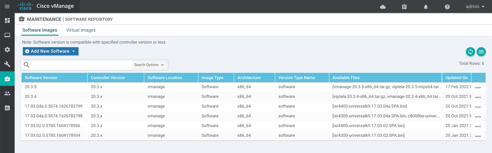{ loading=lazy }
  <figcaption>Current software repository</figcaption>
</figure>

I'll upload each of the images with Add new Software > vManage, so that each image ends up on our vManage.

??? note "Software Image Details"
    - **vManage itself** vmanage-20.6.3-x86_64.tar.gz
    - **vSmart and vBond** viptela-20.6.3-x86_64.tar.gz
    - **MIPS based vEdge models (vEdge 1000)** viptela-20.6.3-mips64.tar.gz
    - **IOS-XE for ISR4300 series (ISR 4331)** isr4300-universalk9.17.06.03a.SPA.bin
    - **IOS-XE for ISR4400 series (ISR 4431)** isr4400-universalk9.17.06.03a.SPA.bin
    - **IOS-XE for Catalyst 8xxx Edge platforms (Catalyst 8300)** c8000be-universalk9.17.06.03a.SPA.bin

<figure markdown>
  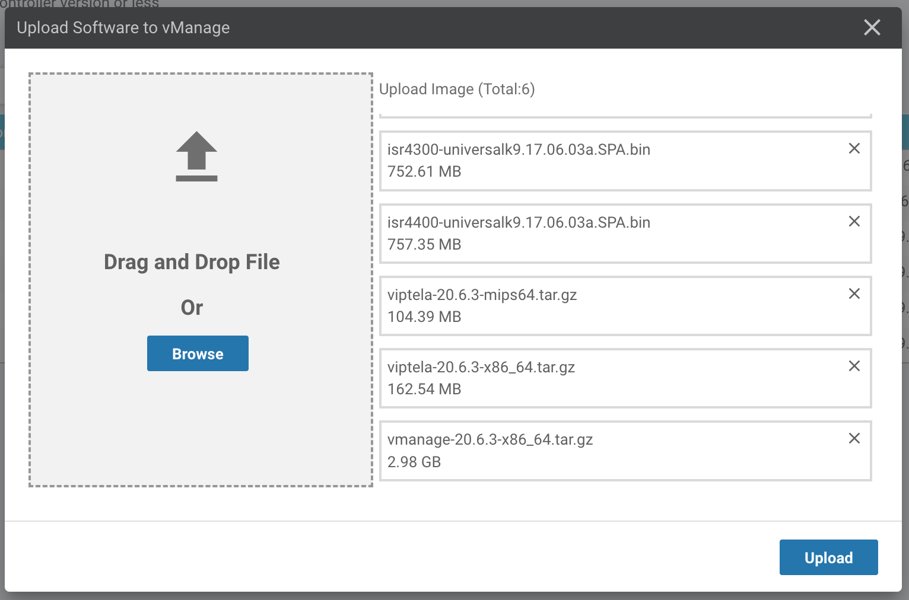{ loading=lazy }
  <figcaption>Upload software to vManage</figcaption>
</figure>

## Step 2: Upgrade vManage
So far, we've only staged files within vManage's Software Repository. No images have been sent to devices, and nothing has been upgraded. Our first step is to apply the upgrade image to vManage.

### First, Take a backup
Before beginning the upgrade, I always take a backup of vManage's configuration database. Just SSH into vManage and use the `request nms configuration-db backup path <path>` command.

``` title="Database backup procedure for vManage"
vManage# request nms configuration-db backup path bz-06-28-22
Starting backup of configuration-db
config-db backup logs are available in /var/log/nms/neo4j-backup.log file
config-db backup is successful. Running consistency check on the backedup database.
Successfully saved database to /opt/data/backup/bz-06-28-22.tar.gz
```

Make sure to copy the file to a safe location once it has completed.

### Start the upgrade
You can begin the upgrade by navigating to *Maintenance > Software Upgrade > vManage*.

!!! tip "Tip"

    vManage is completely out of band management. It is not involved in the transfer of data, generation of encryption keys, or exchange of routing information. During the upgrade, vManage will be unavailable. This won't have any impact on production traffic.

From there, use the Upgrade button to select the new image to apply to vManage.

<figure markdown>
  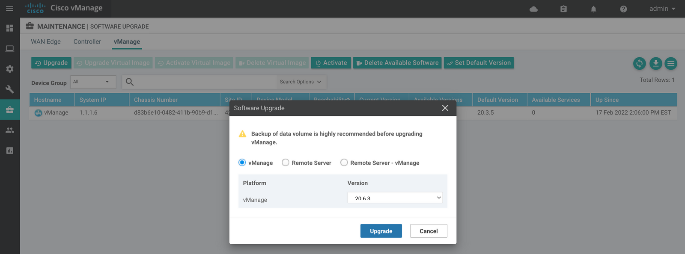{ loading=lazy }
  <figcaption>Upgrade vManage</figcaption>
</figure>

<figure markdown>
  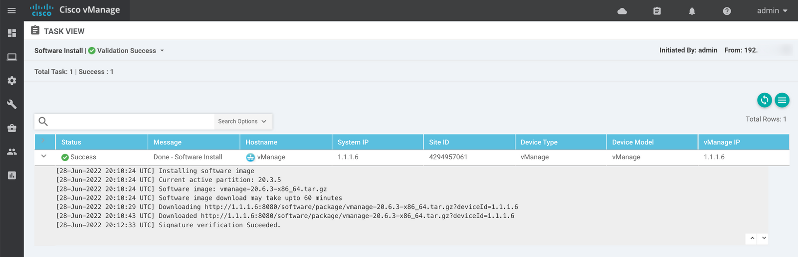{ loading=lazy }
  <figcaption>vManage Software Install</figcaption>
</figure>

So far, we're still running the old version of software (20.3.5). The new version has been downloaded to a new partition and is prepared for activation. We'll need to activate that partition using the *Activate* option within *Maintenance > Software Upgrade > vManage*.

<figure markdown>
  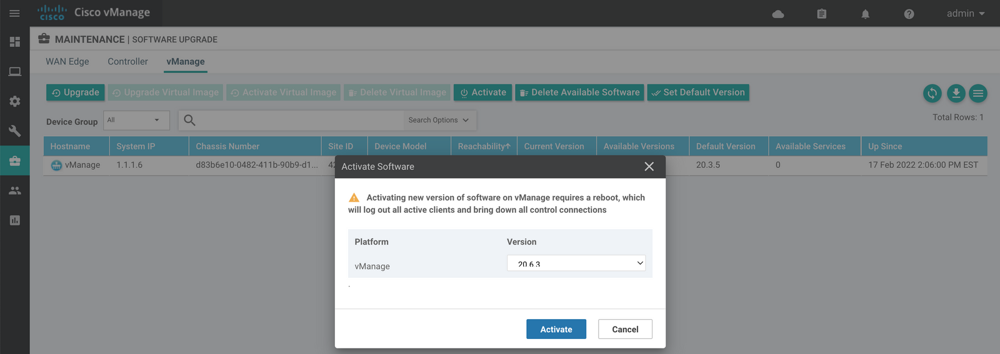{ loading=lazy }
  <figcaption>Activate vManage Software</figcaption>
</figure>

At this point, vMange will be unavailable for a few minutes while the activation completes. I would suggest starting a constant ping to monitor the progress.

After the vManage upgrade has successfully completed, you'll want to do a bit of quick cleanup.

### Set Default Version
Activating the software does not automatically set the default version of software upon reboot. This way, if something were to fail, vManage would reboot to the old (working) software partition. Go to *Maintenance > Software Upgrade > vManage* and choose *Set Default Version*.

### Delete Old Verison(s)
Though not required, I prefer to cleanup old and unnecessary software images. In my case, 20.3.5 and 20.3.4 are installed - along with the new version 20.6.3. I prefer to leave a partition with the last version (20.3.5) installed in case of a quick rollback. Head over to *Maintenance > Software Upgrade > vManage* and then choose *Delete Available Software*. In my case, I'll delete 20.3.4.

## Step 3: Upgrade vSmart / vBond
After a successful vManage upgrade, it's time to upgrade our controllers - vSmart and vBond. Navigate to *Maintenance > Software Upgrade > Controllers*. You have the option to choose one or many controllers to upgrade.

<figure markdown>
  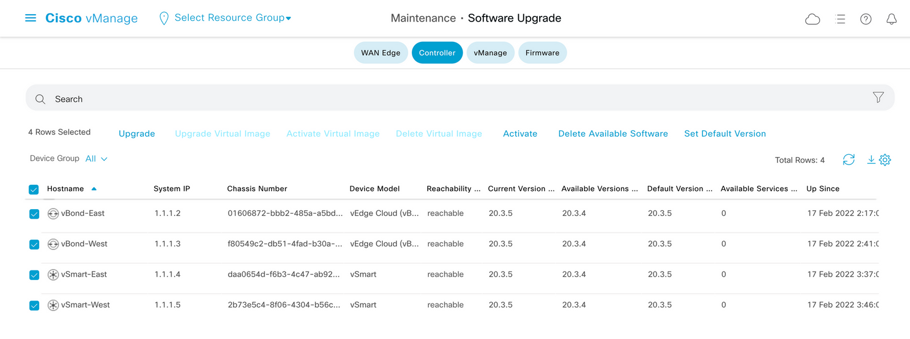{ loading=lazy }
  <figcaption>Controller Software Upgrade</figcaption>
</figure>

I'm going to choose all four controllers (two vSmart and two vBond) and select *Upgrade*.

We can skip a step here, and choose the *Activate and Reboot* option. This will cause the software image to be installed to each controller and then activated (which requires a reboot).

<figure markdown>
  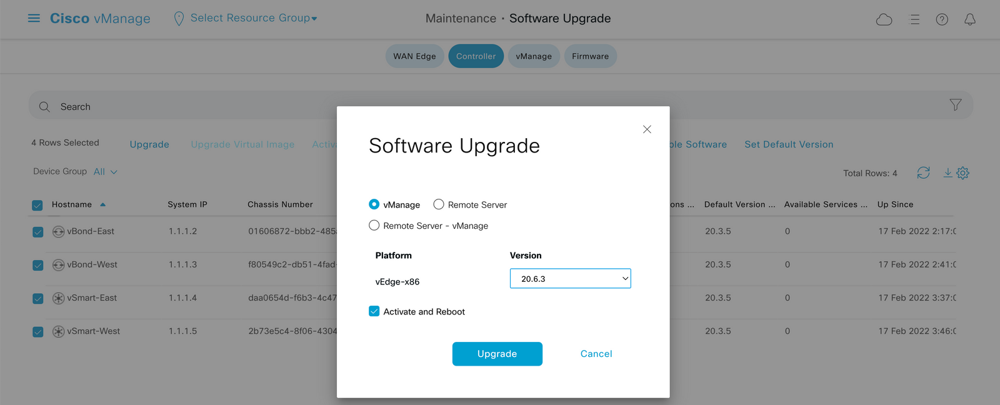{ loading=lazy }
  <figcaption>Controller Software Upgrade - Activate and Reboot</figcaption>
</figure>

vSmart and vBond do not pass any data traffic themselves, but vSmart quite literally is the control plane of the network - responsible for calculating routing decisions and exchanging encryption keys.

vManage has us covered with multiple features to ensure that there is no drop in the network during the upgrade.

1. Each controller upgrades individually - with each subsequent device waiting for an "OK" from it's successor.
2. By default **OMP Graceful Restart** is enabled. With this feature the Edge devices cache routing information for 12 hours. Data traffic would continue to flow if both vSmart went down, and the routing table would be repopulated upon a successful control connection.

<figure markdown>
  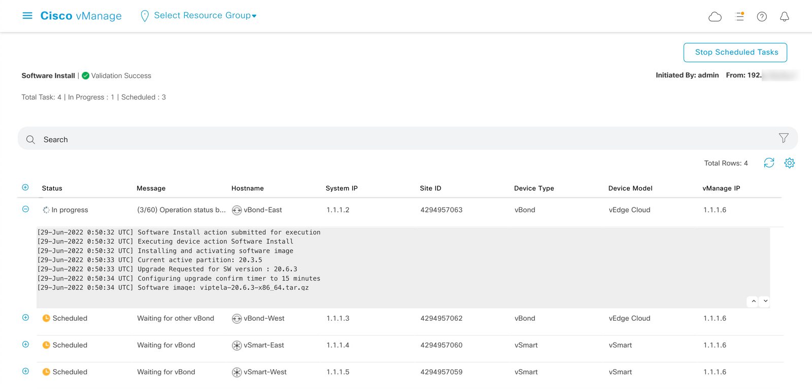{ loading=lazy }
  <figcaption>Individual controller upgrades</figcaption>
</figure>

The upgrades may take a few minutes (6-7 minutes per controller in my case) but this part of the process is touch-less. Just monitor the progress as each controller upgrades and reboots.

<figure markdown>
  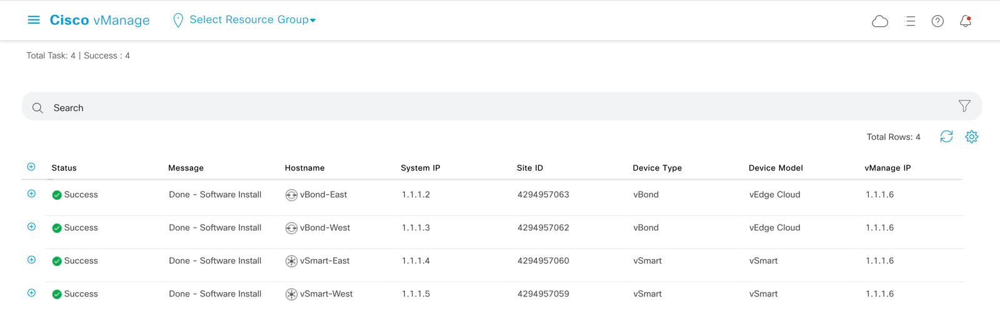{ loading=lazy }
  <figcaption>Controller Software Upgrade Complete</figcaption>
</figure>

Success! All controllers are now running 20.6.3.

As with the vManage upgrade, we'll want to head back to *Maintenance > Software Upgrade > Controllers* and take the same two cleanup steps: set the default version and remove old, unneeded software versions. Similar to vManage, I like to retain the previous image (20.3.5 in this case) as a fallback.

## Step 4: Upgrade vEdge / cEdge
With a successfully upgraded management plane (vManage), control plane (vSmart) and orchestration plane (vBond) the last step is to upgrade the edge devices - or the data plane. Both cEdge and vEdge devices are upgraded using the exact same procedure.

Navigate to *Maintenance > Software Upgrade > WAN Edge* to get started.

<figure markdown>
  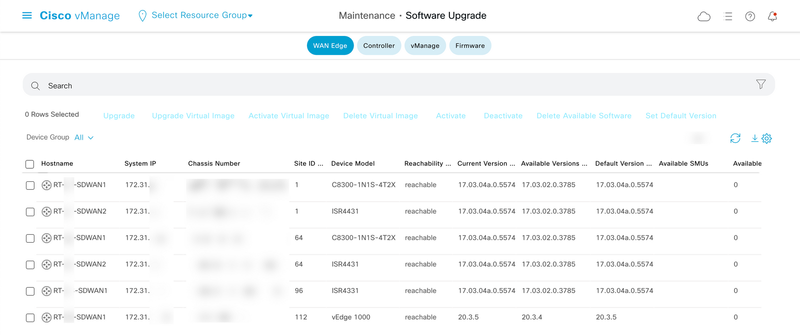{ loading=lazy }
  <figcaption>WAN Edge Software Upgrade</figcaption>
</figure>

While you could choose all devices, and then Upgrade, I'll just choose a vEdge device and a cEdge device for the first round of upgrades. This process is very similar to the controller upgrade process. You can choose *Activate and Reboot* to proceed with the activation of the new image.

!!! tip "Tip"

    You can also not choose Activate and Reboot when upgrading WAN Edges. This will result in the new software image being installed on an inactive partition. When you're ready, this should result in a quicker Activate cycle for sites that do not have redundant WAN Edges.

<figure markdown>
  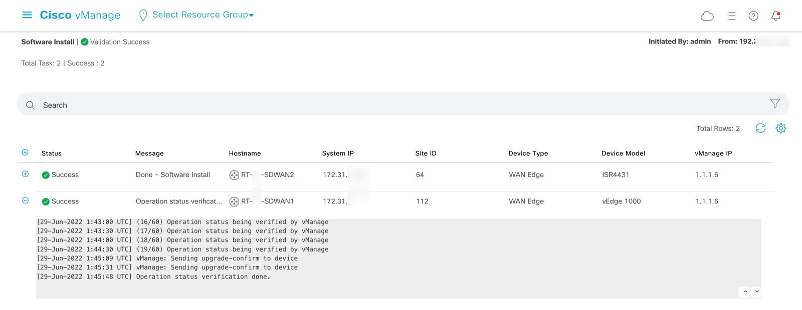{ loading=lazy }
  <figcaption>WAN Edge Upgrade Complete</figcaption>
</figure>

Notice that you get a play-by-play for each individual device. Take a look at the detailed log for the vEdge 1000 below:
``` title="Individual Device Upgrade Log"
[29-Jun-2022 1:29:11 UTC] Software Install action submitted for execution
[29-Jun-2022 1:29:11 UTC] Executing device action Software Install
[29-Jun-2022 1:29:11 UTC] Installing and activating software image
[29-Jun-2022 1:29:15 UTC] Current active partition: 20.3.5
[29-Jun-2022 1:29:15 UTC] Upgrade Requested for SW version : 20.6.3
[29-Jun-2022 1:29:16 UTC] Configuring upgrade confirm timer to 15 minutes
[29-Jun-2022 1:29:16 UTC] Software image: viptela-20.6.3-mips64.tar.gz
[29-Jun-2022 1:29:16 UTC] Software image download may take upto 60 minutes
[29-Jun-2022 1:29:24 UTC] Connection Instance: 1, Color: public-internet
[29-Jun-2022 1:29:24 UTC] Device: Downloading http://1.1.1.6:8080/software/package/viptela-20.6.3-mips64.tar.gz?deviceId=172.31.x.x
[29-Jun-2022 1:32:25 UTC] Device: Downloaded http://1.1.1.6:8080/software/package/viptela-20.6.3-mips64.tar.gz?deviceId=172.31.x.x
[29-Jun-2022 1:34:29 UTC] Device: Signature verification Suceeded.
Signature verification Suceeded.
[29-Jun-2022 1:34:29 UTC] Device: Installed 20.6.3
[29-Jun-2022 1:34:29 UTC] Activating SW version 20.6.3
[29-Jun-2022 1:34:29 UTC] Rebooting device to other partition. Device may take up to 30 minutes before it comes online
[29-Jun-2022 1:35:29 UTC] (1/60) Operation status being verified by vManage
...
[29-Jun-2022 1:44:30 UTC] (19/60) Operation status being verified by vManage
[29-Jun-2022 1:45:09 UTC] vManage: Sending upgrade-confirm to device
[29-Jun-2022 1:45:31 UTC] vManage: Sending upgrade-confirm to device
[29-Jun-2022 1:45:48 UTC] Operation status verification done.
```

After a successful WAN Edge upgrade - you'll still want to set the default image, and cleanup any old images. This is the same procedure performed on vManage, vSmart, and vBond. Like those devices, I suggest leaving the last good image as a fallback option.

Once all WAN Edges are upgraded - you're done!