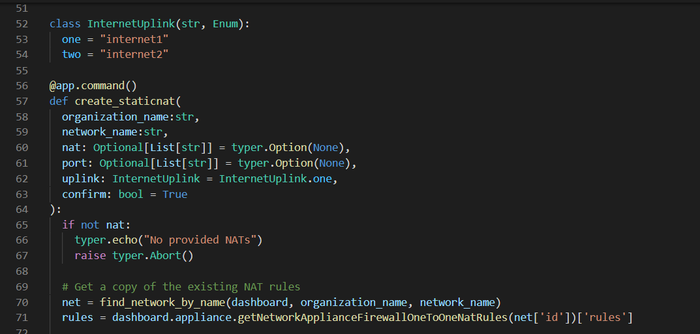

# Meraki automation using Typer



In college, one of my Computer Science professors gave us some sage advice: 

> Computer Scientists are lazy.

He was right.
Any time I can avoid spending time writing code that isn't related to my end goal - I'm all for it. It's an added bonus if I can use a library that gives me tools to easily make my end product more polished and professional.

If you haven't heard of [Typer](https://github.com/tiangolo/typer), it's a library for building CLI applications. It boasts an **easy to understand syntax**, features to **minimize code duplication**, and options to provide **auto-completion and automatic help** for end users.

<!-- more -->

I recently had a migration project from a Cisco ASA to Meraki MX firewall. The ASA had about 20 static NAT entries, each of which required the same set of 10 port allowances. It sounded a bit painful to enter all of that in the GUI, and luckily Meraki has a [great API](https://create.meraki.io)! I enlisted the help of Typer to create a CLI tool.

In it's simplest form, the command line syntax looks like this:

```
create-staticnat <org> <net> --nat <publicIP>|<privateIP> --port <proto>|<port>
```

It takes in an organization and network name, a public/private IP pairing, as well as a protocol/port pairing. The result: a single static NAT entry with a single port permitted from 'any'.
In my case, I needed this same syntax to work for multiple NAT entries - each with a set of permitted ports.

```
create-staticnat OrgName NetName --nat 192.0.2.5|192.168.5.5 --nat 192.0.2.6|192.168.5.6 --port tcp|443 --port udp|8000 --port tcp|80
```

The result? Two NAT entries (192.0.2.5 and 192.0.2.6), each with 3 ports permitted (TCP 80, TCP 443, and UDP 8000).

---

Typer makes it super easy to handle multiple inputs. Here's the definition of my function (and Typer command):

```
@app.command()
def create_staticnat(
  organization_name:str,
  network_name:str,
  nat: Optional[List[str]] = typer.Option(None),
  port: Optional[List[str]] = typer.Option(None)
):
  ....
  # Get each NAT entry
  for entry in nat:
    public_ip, private_ip = entry.split("!")

    # Get the list of ports for each entry
    for p in port:
      proto, num = entry.split("!")
```

I'm omitting the actual meat of my code above, but the important part of that you can ask Typer to accept a *CLI option* (like --nat) multiple times using this syntax: `nat: Optional[List[str]]`. The multiple options are presented as a Python list. 
What happens if the user doesn't input any ports? They are "options" after all. The syntax ` = typer.Option(None)` accounts for that by setting the default option to `None`. The result is that you can easily say:

```
if nat is None:
  print("I have nothing to do!")
```

Typer has great documentation, so don't just take my word for it: [Multiple CLI Options](https://typer.tiangolo.com/tutorial/multiple-values/multiple-options/).

---

It's also great to have self documenting tools. I often create a tool like this, and end up wanting to share it with other members of my team. By defining everything with Typer a `--help` is generated for you.

```
> python .\merakitools.py create-staticnat --help
Usage: merakitools.py create-staticnat [OPTIONS] ORGANIZATION_NAME NETWORK_NAME

Arguments:
  ORGANIZATION_NAME  [required]
  NETWORK_NAME       [required]

Options:
  --nat TEXT                      'publicIP|prviateIP' or
                                  'name|publicIP|privateIP'

  --port TEXT                     'protocol|portNum' or
                                  'protocol|portNum|permittedIPs'

  --uplink [internet1|internet2]  [default: internet1]
  --confirm / --no-confirm        [default: True]
  --help                          Show this message and exit.
```

It's so easy to do this - with Typer even accounting for things like set lists of options and true/false inputs.

```
class InternetUplink(str, Enum):
  one = "internet1"
  two = "internet2"

@app.command()
def create_staticnat(
  organization_name:str,
  network_name:str,
  nat: Optional[List[str]] = typer.Option(None, help="'publicIP|prviateIP' or 'name|publicIP|privateIP'"),
  port: Optional[List[str]] = typer.Option(None, help="'protocol|portNum' or 'protocol|portNum|permittedIPs'"),
  uplink: InternetUplink = InternetUplink.one,
  confirm: bool = True
):
```

In the example above, the uplink option is defined using Typer's [Enum - Multiple Choices](https://typer.tiangolo.com/tutorial/parameter-types/enum/) CLI parameter type. This gives the user only two valid choices: "internet1" or "internet2" - which will be passed into the function as "one" or "two". This is a great way to get help with your error checking.

The *confirm* option is nice as well. By defining `confirm: bool = True`, the default option is to "confirm" input from the user. To avoid a conformation prompt, just enter the `--no-confirm` option.

---

These examples are only a couple of Typer's many great features - and if you like what you see - check out [FastAPI](https://fastapi.tiangolo.com/) from the same developer.

My Meraki tools project featured in the examples above is always a work in progress - and gets attention whenever there is something new I need to accomplish with the Meraki API. Please check it out on GitHub!

https://github.com/billyzoellers/merakitools