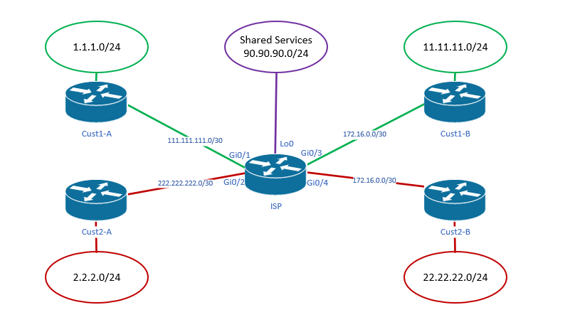

---
search:
  exclude: true
---

# VRF lite

## Requirements from CCNP ROUTE
* 3.8 - Configure and verify VRF lite

----



## Configuring VRFs
* Create a new VRF `ip vrf Red`

Assign an interface to a VRF *important to reassign any IP addressing*
```
interface GigabitEthernet0/1
    ip vrf forwarding Green
    % Interface GigabitEthernet0/1 IPv4 disabled and address(es) removed due to enabling VRF Green
```

Configuring a route-distinguisher (RD) for each VRF
* RD can be either an AS number + arbitrary number, or IP address and arbitrary number (i.e. xxx:y or A.B.C.D:y)

```
ip vrf Green
    rd 50:1
```

Review VRFs that have been created, and the interfaces that are members of them
```
show ip vrf
  Name                             Default RD            Interfaces
  Green                            50:1                  Gi0/1
                                                         Gi0/2
  Purple                           50:99                 Lo0
  Red                              50:2                  Gi0/3
                                                         Gi0/4
```

---
## EIGRP with multiple VRFs
```
router eigrp 2
 !
 address-family ipv4 vrf Green autonomous-system 2
  network 111.111.111.0 0.0.0.3
  network 172.16.0.0 0.0.0.3
  eigrp router-id 99.99.99.1
 exit-address-family
 !
 address-family ipv4 vrf Red autonomous-system 2
  network 172.16.0.0 0.0.0.3
  network 222.222.222.0 0.0.0.3
  eigrp router-id 99.99.99.1
 exit-address-family
```

----
## Sharing Routes Between VRFs
You can use the `rd` command along with `route-target` to share routes amoung the separate VRFs. The `route-target` command is only used if BGP is running.

Import routes from each VRF into BGP. In this example, Green/Red are running EIGRP and purple is just a local interface on the 'ISP' router.
```
router bgp 65000
 bgp router-id 99.99.99.1
 bgp log-neighbor-changes
 !
 address-family ipv4 vrf Green
  redistribute eigrp 2
 exit-address-family
 !
 address-family ipv4 vrf Purple
  redistribute connected
 exit-address-family
 !
 address-family ipv4 vrf Red
  redistribute eigrp 2
 exit-address-family
```

Keep in mind that we're not using BGP to share routes amount routers in this case, just VRF's.
```
show ip bgp vpnv4 all      
BGP table version is 10, local router ID is 99.99.99.1
Status codes: s suppressed, d damped, h history, * valid, > best, i - internal, 
              r RIB-failure, S Stale, m multipath, b backup-path, f RT-Filter, 
              x best-external, a additional-path, c RIB-compressed, 
              t secondary path, 
Origin codes: i - IGP, e - EGP, ? - incomplete
RPKI validation codes: V valid, I invalid, N Not found

     Network          Next Hop            Metric LocPrf Weight Path
Route Distinguisher: 50:1 (default for vrf Green)
 *>   1.1.1.0/24       111.111.111.2       130816         32768 ?
 *>   11.11.11.0/24    172.16.0.2          130816         32768 ?
 *>   111.111.111.0/30 0.0.0.0                  0         32768 ?
 *>   172.16.0.0/30    0.0.0.0                  0         32768 ?
Route Distinguisher: 50:2 (default for vrf Red)
 *>   2.2.2.0/24       222.222.222.2       130816         32768 ?
 *>   22.22.22.0/24    172.16.0.2          130816         32768 ?
 *>   172.16.0.0/30    0.0.0.0                  0         32768 ?
 *>   222.222.222.0/30 0.0.0.0                  0         32768 ?
Route Distinguisher: 50:99 (default for vrf Purple)
 *>   99.99.99.0/24    0.0.0.0                  0         32768 ?
```

Now, use the `route-target` keyword to 'leak' the appropriate routes between VRFs.
```
ip vrf Green
 rd 50:1
 route-target export 50:1
 route-target import 50:99
ip vrf Purple
 rd 50:99
 route-target export 50:99
 route-target import 50:1
 route-target import 50:2
ip vrf Red
 rd 50:2
 route-target export 50:2
 route-target import 50:99
```

Now the VRFs on **ISP** have the appropriate routes from vrf-Purple. The last step is to redistribute these routes back out of BGP into EIGRP so the spokes have access.
```
router eigrp 2
 !
 address-family ipv4 vrf Green autonomous-system 2
  redistribute bgp 65000 metric 2000 20 255 1 1500
  network 111.111.111.0 0.0.0.3
  network 172.16.0.0 0.0.0.3
  eigrp router-id 99.99.99.1
 exit-address-family
 !
 address-family ipv4 vrf Red autonomous-system 2
  network 172.16.0.0 0.0.0.3
  network 222.222.222.0 0.0.0.3
  eigrp router-id 99.99.99.1
 exit-address-family
```

---

## References
[Configuring VRF-lite (Cisco)](https://www.cisco.com/c/en/us/td/docs/switches/lan/catalyst4500/12-2/31sg/configuration/guide/conf/vrf.pdf)
[Inter-VRF Routing with VRF Lite (PacketLife.net)](https://packetlife.net/blog/2010/mar/29/inter-vrf-routing-vrf-lite/)